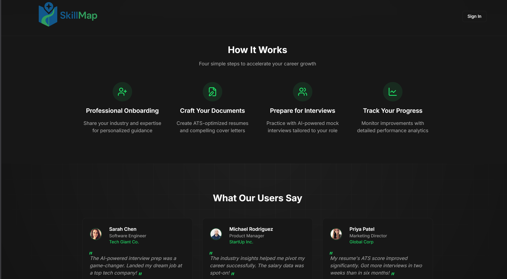
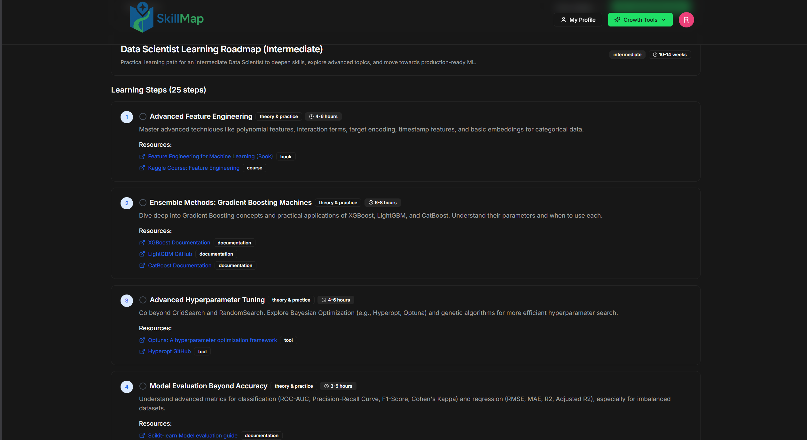

<h1 align="center">Hey, I am  Rohit Manoj! Good to see you here! 👋</h1>

  

🎓 Mathematics and Computing @ NIT Warangal  
📊 Machine Learning | Data Science | Data-driven Systems

             

<h2>🚀 About Me</h2>

I am a second-year undergraduate in Mathematics and Computing at NIT Warangal, with a strong foundation in Machine Learning and Data Science and a focus on working on impactful, data-driven problems. I am particularly interested in research-oriented approaches that require mathematical analysis and reasoning to structure and understand the data.

My work deals with understanding how mathematics help in structuring and  analyzing data, from which we can obtain valubale insights. I have familiarity with advanced mathematical concepts from functional analysis, particularly <b>operator theory and Banach spaces</b>, which shape my approach to problem solving. I am also comfortable working on projects in interdisciplinary areas like <b>computational genomics</b> and <b>Drug-Target Interaction</b>, applying data analysis and modeling techniques to biological data.

<ul>
  <li>Machine Learning</li>
  <li>Data Visualization</li>
  <li>Mathematical Modeling</li>
  <li>Functional Analysis (Operator Theory, Banach Spaces)</li>
  <li>Computational Genomics</li>
  <li>Drug Action</li>
</ul>

             

             

<h2>🧠 Current Focus</h2>

<ul>
  <li>Building systems involving <b>personalization and recommendation</b></li>
  <li>Structuring and analyzing real-world data</li>
  <li>Strengthening foundations in probability, statistics, and ML</li>
  <li>Designing systems that evolve from logic → intelligent models</li>
</ul>

             

<h2>🔬 Research Interests</h2>

<ul>
  <li>Recommender Systems</li>
  <li>Data-driven decision making</li>
  <li>Structured representation of real-world problems</li>
  <li>Optimization in Machine Learning</li>
  <li>Bridging mathematics with practical ML systems</li>
</ul>

             

<h2>💻 Featured Project</h2>

<h3>🔗 Breast Cancer Detection</h3>

A machine learning project that predicts whether a tumor is <b>benign</b> or <b>malignant</b> using medical data and classification algorithms.

<ul>
  <li>Built using Logistic Regression on a real-world dataset</li>
  <li>Includes data analysis, visualization, and model evaluation</li>
  <li>Provides predictions with probability scores</li>
</ul>

  

<h3>🔗 SkillMap</h3>

A platform that generates <b>personalized career roadmaps</b> using a data-driven approach.

<ul>
  <li>Creates tailored learning paths for different roles</li>
  <li>Breaks down complex goals into structured steps</li>
  <li>Designed with personalization and scalability in mind</li>
</ul>

  

<b>Preview</b>

  
  
    
  
  

             

<h2>🛠️ Tools & Technologies</h2>

  
  
  
  
  
  
  
  
  
  
  
  
  
                                                      
  
  

             

<h2>📈 What I’m Looking For</h2>

I am currently looking for <b>internship opportunities in Machine Learning / Data Science</b>.

             

<h2>🤝 Connect with Me</h2>

   
  Email: rohitmknair@gmail.com

   
  LinkedIn: https://www.linkedin.com/in/rohit-manoj/

             

⭐ Always open to collaboration and interesting problems!

